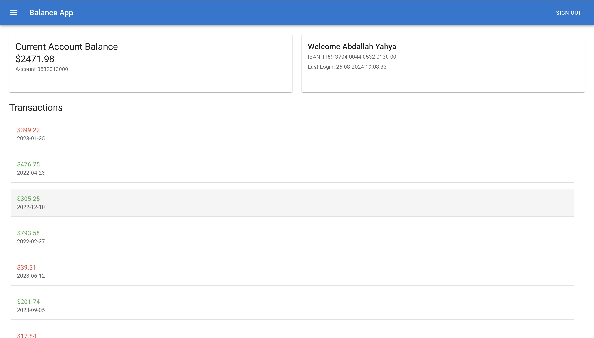

# Balance App

Balance App is a simple application that shows a user's current balance and their cumulative balance.

  

## Getting Started

Follow these steps to get the app up and running:

### Prerequisites

- Node.js
- npm (comes bundled with Node.js)

### Installation

1. Clone this repository:
   ```sh
   git clone https://github.com/AbdullahADhaim/BalanceApp.git
   ```

2. Navigate to the project directory:
   ```sh
   cd balance-app
   ```

3. Install the required packages:
   ```sh
   npm install
   ```

4. Start the development server:
   ```sh
   npm start
   ```

The app should now be running on [http://localhost:3000](http://localhost:3000).


